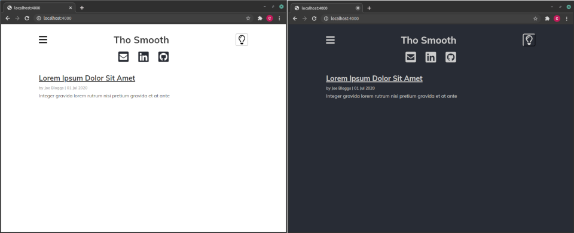
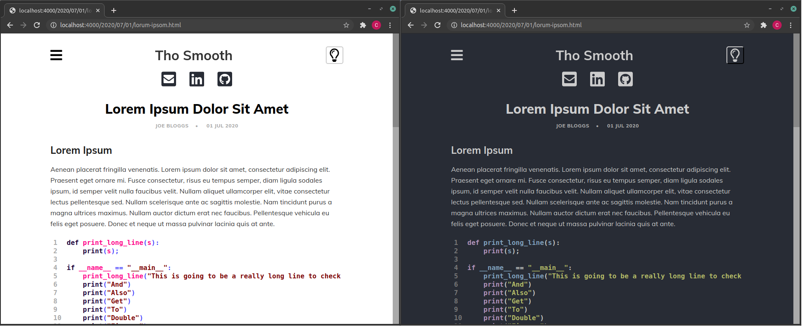
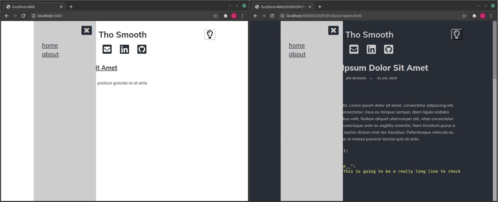

# ThoSmooth Jekyll Theme

---
- [Introduction](#introduction)
- [Building](#building)
- [Example Pages](#example-pages)
  - [Index Page](#index-page)
  - [Post Page](#post-page)
  - [Pop-up Hamburger Menu](#pop-up-hamburger-menu)

---
## Introduction

ThoSmooth is a simple jekyll theme with light and dark modes, and a hamburger-style pop-out navigation menu.

## Building

The theme can be viewed by cloning this repo and using `jekyll serve`.

## Example Pages

### Index Page

NOTE: No pagination on index pages, just vertical scroll.

### Post Page

Dark Mode code blocks are based on Chris Kempson's 'Tomorrow Night' theme. Light Mode code blocks are based on the Rougify 'Magritte' theme.

### Pop-up Hamburger Menu

Hamburger menu populates automatically by scanning for markdown pages (documents ending in `.md`) in the root directory of the Jekyll site. 

