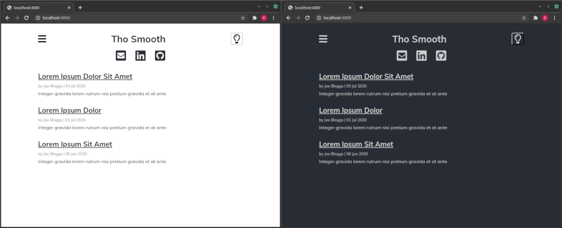

# ThoSmooth Jekyll Theme
by Chris Akers

## Introduction

ThoSmooth is a simple jekyll theme with both light and dark modes.

To take a look, just clone the repo and run `jekyll serve`.

### Index Page

NOTE: No pagination on index pages, yet.

### Posts

Dark Mode code blocks are based on the Tomorrow Night syntax theme, originally by Chris Kempson, and Light Mode code blocks are based on the Rougify Magritte theme.

### Hamburger Menu

Hamburger menu is populated automatically by scanning for pages in the root dir of the site. 

## To Change the Look and Feel

Main CSS is in /site-assets/css/tho-smooth.css.

Code CSS is in /site-assets/css/syntax.css.